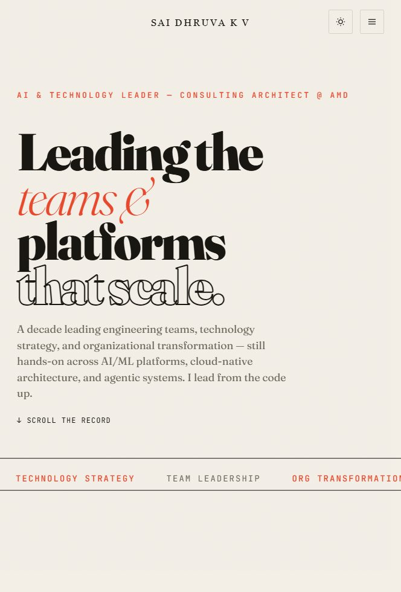
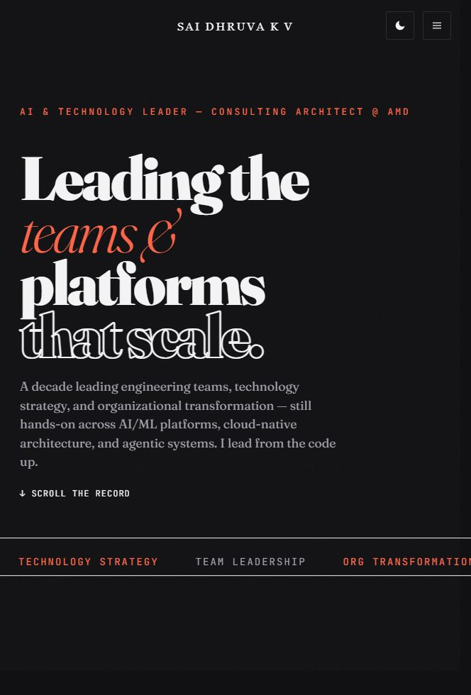

<div align="center">

# sdkv.in

**Personal portfolio of Sai Dhruva K V** — AI &amp; Technology Leader, Consulting Architect @ AMD.

[**→ Visit the live site**](https://sdkv.in)

</div>

<table>
<tr>
<td width="50%"></td>
<td width="50%"></td>
</tr>
</table>

---

## About

A decade leading engineering teams, technology strategy, and organizational
transformation — still hands-on across AI/ML platforms, cloud-native architecture, and
agentic systems. This is the source of my personal site: a fast, accessible, zero-dependency
portfolio designed to read like an editorial publication rather than a résumé.

The content (roles, capabilities, impact) lives in a single data file and renders into a
type-led, single-page experience.

## Design language — "Kinetic Editorial"

Type-as-art, museum-gallery restraint. One serif for display, one mono for metadata, one
script-serif for the identity, and a single accent colour used sparingly.

- **Display / headings** — [Fraunces](https://fonts.google.com/specimen/Fraunces) (variable serif)
- **Metadata / UI** — [JetBrains Mono](https://fonts.google.com/specimen/JetBrains+Mono)
- **Brand mark** — [Italiana](https://fonts.google.com/specimen/Italiana) (the `SD` monogram &amp; `SAI DHRUVA K V` wordmark)
- Kinetic hero headline (parallax to cursor + scroll-driven letter-spacing)
- Sequenced page-load intro: logo letters → nav → hero content, in order
- Animated favicon (the `SD` monogram, drawn from outlined Italiana glyphs)
- Film-grain overlay; numbered sections; a marquee keyword strip

### Palette

| Token | Light | Dark |
|---|---|---|
| Paper (background) | `#f3efe7` | `#111113` |
| Ink (text) | `#16140f` | `#f4f4f5` |
| Accent (the only one) | `#e8472b` | `#ff6347` |

No gradients, no shadows, no second accent. Light/dark follows the OS via CSS
`light-dark()`, with a System → Light → Dark toggle.

## Tech &amp; principles

**Zero dependencies. No build step. No framework.** Pure HTML + CSS + vanilla JavaScript.

- Runs straight from `file://` or any static host — nothing to compile
- JS is organised as IIFE modules, one global each, loaded in a fixed order
- Honors `prefers-reduced-motion` throughout (every animation has a still fallback)
- Semantic HTML, skip link, ARIA on icon-only controls, keyboard-reachable
- A single web-font request; content is readable before JS runs

## Project structure

```
sdkv.in/
├── index.html          # single page — editorial section stack
├── index.css           # the full "Kinetic Editorial" design system (light-dark tokens)
├── js/
│   ├── data.js         # SITE_DATA — roles, capabilities, impact (the only content source)
│   ├── kinetic.js      # builds DOM from SITE_DATA + animates the hero headline
│   ├── animations.js   # scroll-reveal + count-up metrics (IntersectionObserver)
│   └── main.js         # topbar, theme toggle, mobile nav, animated favicon, copy-email
├── logos/              # brand assets — SD monogram + SAI DHRUVA wordmark (Italiana)
├── docs/               # README screenshots (not served by the site)
├── CNAME               # custom domain — sdkv.in (do not delete)
└── CLAUDE.md           # working notes / conventions for AI-assisted edits
```

**Script load order** (bottom of `index.html`): `data.js → kinetic.js → animations.js → main.js`.
`main.js` runs last and orchestrates the rest on `DOMContentLoaded`.

## Run locally

It's a static site, so either works:

```bash
# 1. Simplest — just open the file
open index.html            # (or double-click it)

# 2. Local server — recommended (accurate web fonts + clipboard APIs)
npx serve -l 4321 .
# → http://localhost:4321
```

> When browsing subfolders like `/logos/`, keep the trailing slash
> (`/logos/`, not `/logos`) so relative asset paths resolve.

## Deploy

Hosted on **GitHub Pages** with the custom domain `sdkv.in`.

```bash
git push origin master   # GitHub Pages serves the repo root — no build, no CI
```

> ⚠️ **Never delete `CNAME`.** It contains `sdkv.in` and is required for the custom domain;
> removing it breaks DNS routing for the live site.

## Brand assets

The identity is set in **Italiana**. Source SVGs live in [`logos/`](logos/):

- `logos/concept-monogram/` — the **SD** mark (favicon / avatar / badge)
- `logos/concept-wordmark/` — the **SAI DHRUVA K V** wordmark (site header)

Each provides `light.svg`, `dark.svg`, and seamless-loop `animated-light.svg` / `animated-dark.svg`.

## Accessibility &amp; performance

- Every animation respects `prefers-reduced-motion` and degrades to a static end state
- OS-driven theming via `light-dark()`; an explicit toggle persists to `localStorage`
- Skip-to-content link, semantic landmarks, focus-visible outlines, ARIA on icon controls
- The animated favicon and load intro both fall back gracefully (and never freeze the UI in a
  backgrounded tab)
- No external JS/CSS frameworks; a single Google Fonts request; content renders without JS

---

<div align="center">

© Sai Dhruva K V · Designed to discourage printing — Save Paper · Save Trees 🌱

</div>
